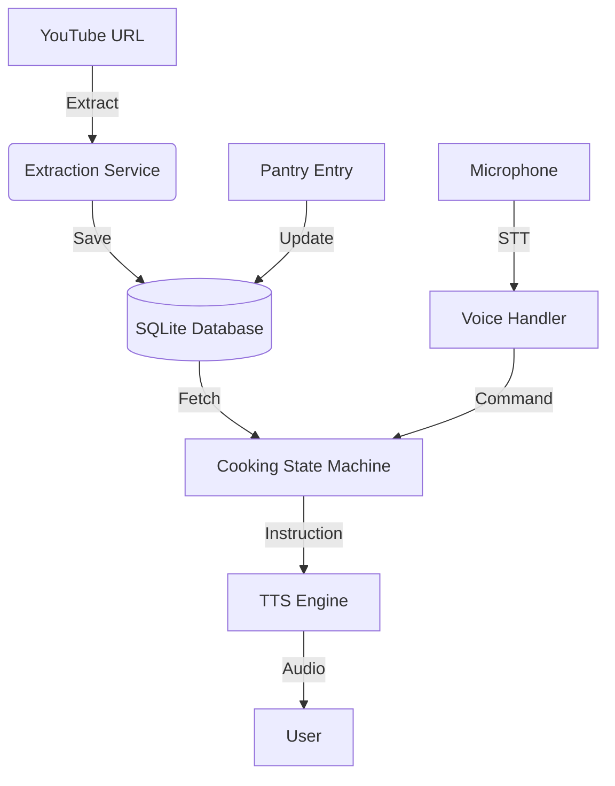

# Backend Architecture: Smart Cooking Assistant

## 1. Overview
The Smart Cooking Assistant is an **Offline-First Mobile Application** designed for reliability in the kitchen. It uses a structured data layer to manage complex recipe steps, pantry inventory, and real-time voice state.

---

## 2. Recommended Tech Stack
**Choice: React Native (Expo) + SQLite (expo-sqlite)**

| Component | Choice | Justification |
| :--- | :--- | :--- |
| **Framework** | React Native (Expo) | Cross-platform (Android/iOS) with fast iteration and standard voice APIs. |
| **Data Layer** | SQLite | Robust, relational storage. Critical for complex recipe/pantry relations. |
| **State Management** | Zustand | Lightweight, high-performance state for real-time voice/step tracking. |
| **Voice Engine** | Expo Speech / Recognition | Low latency and built-in permission handling. |

---

## 3. Data Models (Schema)

### Recipe Model
```json
{
  "id": "uuid",
  "title": "string",
  "youtubeUrl": "string",
  "prepTime": "int (mins)",
  "servings": "int",
  "calories": "int",
  "ingredients": [
    { "name": "string", "amount": "string", "isPantryMatch": "boolean" }
  ],
  "steps": [
    { "index": "int", "instruction": "string", "timer": "int (secs)", "image": "string" }
  ]
}
```

### Pantry Model
```json
{
  "id": "uuid",
  "name": "string",
  "category": "enum (Spices, Vegetables, etc.)",
  "quantity": "float",
  "unit": "string",
  "expiryDate": "timestamp",
  "lastUpdated": "timestamp"
}
```

---

## 4. Core Function Layers

### A. Extraction Service (`youtubeApi.js`)
*   **Input:** YouTube URL string.
*   **Output:** Structured JSON Recipe Object.
*   **Logic:**
    1.  Call Node.js/Python backend (Scraping/API).
    2.  Sanitize and format steps.
    3.  Calculate macro-estimates.

### B. Voice Orchestrator (`voiceHandler.js`)
*   **Input:** Continuous Audio Stream.
*   **Output:** State Action (NEXT_STEP, REPEAT, etc.).
*   **Logic:**
    1.  Listen for wake-word "Hey Chef".
    2.  Fuzzy-match transcript against command library.
    3.  Trigger TTS (Text-to-Speech) for step read-back.

### C. Pantry Matcher (`pantryLogic.js`)
*   **Input:** Recipe Ingredients + Pantry Table.
*   **Output:** Missing Items List + Match Percentage.
*   **Logic:** Relational Join between `pantry` and `recipe_ingredients` using string-similarity (Levenshtein).

---

## 5. Data Flow Diagram



---

## 6. File Structure
```text
/SmartCookingApp
  /src
    /services
      - database.js      (SQLite Init & CRUD)
      - voiceHandler.js   (STT/TTS logic)
      - youtubeApi.js     (URL Extraction)
    /store
      - useStore.js       (Global Zustand state)
    /hooks
      - useCooking.js     (Step navigation & voice wiring)
    /screens
      - Home.js
      - Pantry.js
      - CookingMode.js
      - EmergencyFix.js
    /theme
      - index.js          (Saffron/Dark design tokens)
```
